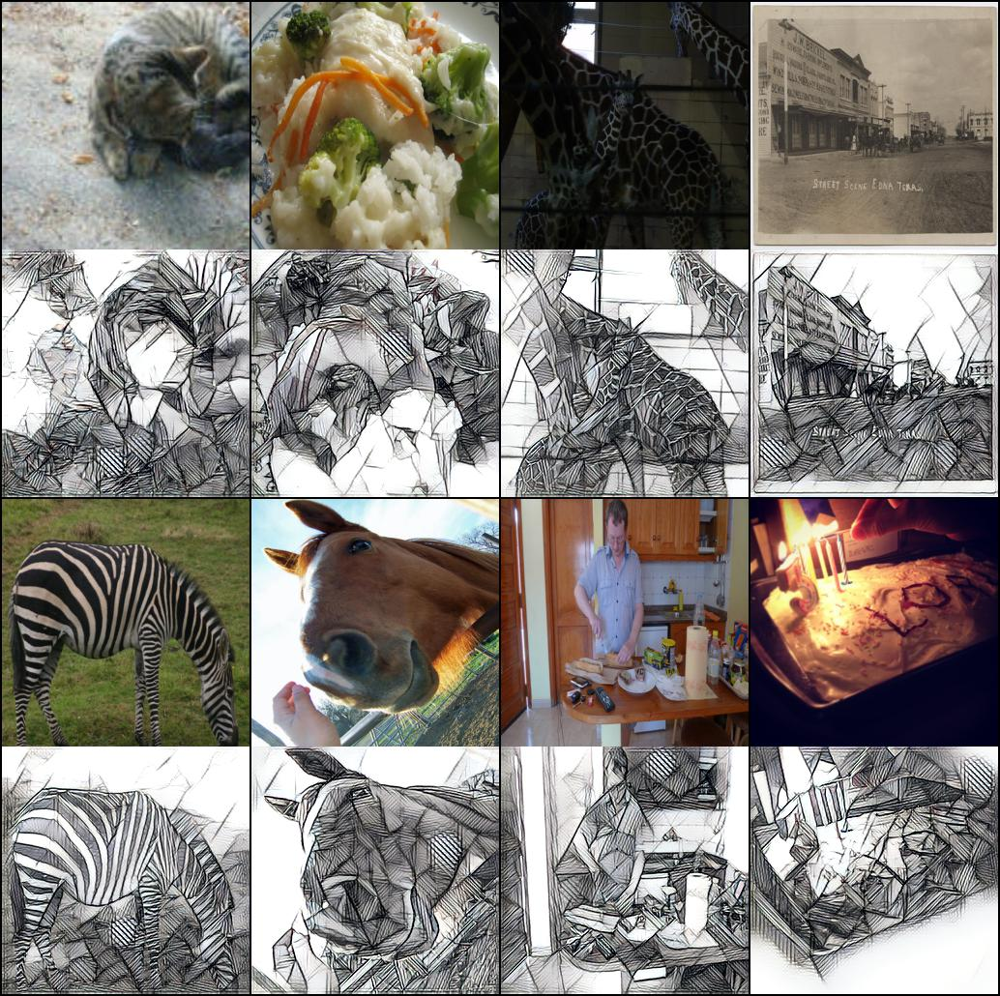

# 快速图像风格迁移 Fast Neural Style Transfer

## Background

Fast neural style transfer is a method by which the content of one image can be fused with the style of another image. It is based upon JC Johnson et al.s' fast style transfer [paper.](./NST/NeuralNetworks/_paper)

## Related Efforts

- [Fast Neural Style Transfer in PyTorch](https://github.com/eriklindernoren/Fast-Neural-Style-Transfer)  
PyTorch implementation of [Fast Neural Style Transfer](https://cs.stanford.edu/people/jcjohns/eccv16/) ([official Lua implementation](https://github.com/jcjohnson/fast-neural-style)).

## Maintainers

[@bugstop](https://github.com/bugstop)

## License

[BSD-3-Clause License](LICENSE) © bugstop